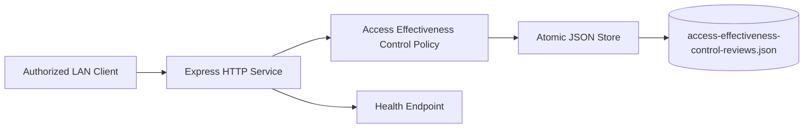
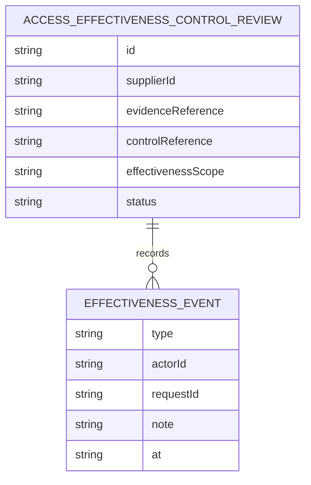
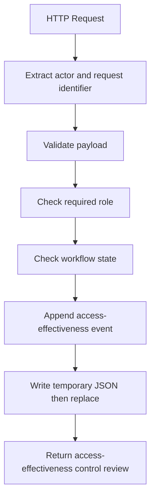
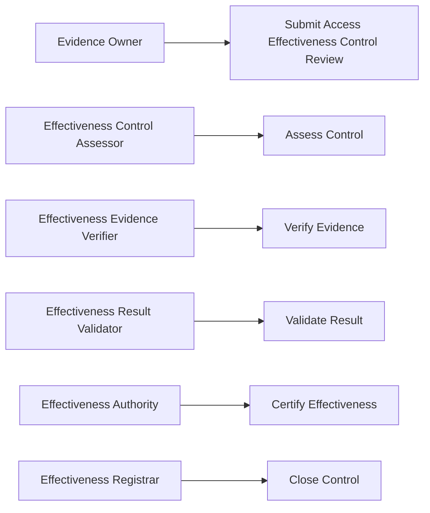
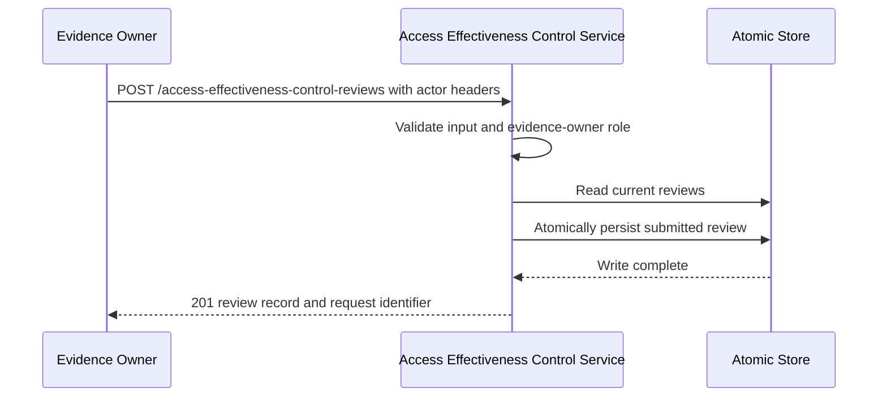

# Supplier Evidence Access Effectiveness Control Platform

## The Problem

Supplier evidence access controls become unreliable when effectiveness assessments, test evidence, and result validation are recorded inconsistently. Without independent control points, organizations cannot establish whether a control operated effectively or whether its result was formally certified.

## The Solution

This service records an access-effectiveness control review through five independent roles: effectiveness-control assessor, effectiveness-evidence verifier, effectiveness-result validator, effectiveness authority, and effectiveness registrar. The domain layer enforces a monotonic lifecycle, requires the responsible role for each transition, validates input before mutation, retains state on rejected requests, and persists accepted records using atomic JSON replacement.

## Live Demo and Tech Stack

This repository provides a runnable HTTP service for controlled local-network use. The default port is `65038`, and the process binds to `0.0.0.0`.

| Area | Implementation |
| --- | --- |
| Runtime | Node.js 22 with ECMAScript modules |
| HTTP service | Express 5 |
| Tests | Vitest and Supertest |
| Persistence | Atomic JSON file replacement |
| Delivery controls | GitHub Actions, static checks, and production dependency audit |

## Local Setup and Run Instructions

Use Node.js 22 or later.

```bash
git clone https://github.com/kholipha-ahmmad-al-amin/supplier-evidence-access-effectiveness-control-platform.git
cd supplier-evidence-access-effectiveness-control-platform
npm ci
npm run check
npm test
npm start
```

Confirm readiness from a second terminal:

```bash
curl http://127.0.0.1:65038/health
```

Submit an access-effectiveness control review as the evidence owner:

```bash
curl -X POST http://127.0.0.1:65038/access-effectiveness-control-reviews \
  -H 'content-type: application/json' \
  -H 'x-actor-id: supplier-evidence-owner' \
  -H 'x-actor-role: evidence_owner' \
  -H 'x-request-id: effectiveness-submit-0001' \
  -d '{"supplierId":"SUP-835","evidenceReference":"EVD-835","controlReference":"CTL-835-ACCESS-01","effectivenessScope":"access_control"}'
```

Advance the record in order with `assessControl`, `verifyEvidence`, `validateResult`, `certifyEffectiveness`, and `closeControl`. Each transition is a `POST` to `/access-effectiveness-control-reviews/{id}/{action}` with a non-empty JSON `note`, a unique actor identifier, and the role required by that action.

Run `npm audit --omit=dev --audit-level=high` to evaluate production dependencies. This command evaluates production packages only. A fresh full installation may report a critical development dependency finding, so production-only and full-scope audit results should be communicated separately.

## System Documentation

### System Architecture Diagram



### Entity-Relationship Diagram



### Data Flow Diagram



### Use Case Diagram



### Sequence Diagram



## Owner

Created and maintained by Kholipha Ahmmad Al-Amin.

Software Engineer and AI Specialist

Founder and CEO of EquiSaaS BD

Principal Consultant at AR IT Consultancy

Full Stack Developer and SaaS Product Builder

### Official links

Portfolio: https://kholipha-ahmmad-al-amin.equisaas-bd.com/

GitHub: https://github.com/kholipha-ahmmad-al-amin

LinkedIn: https://www.linkedin.com/in/kholipha-ahmmad-al-amin

X: https://x.com/al_amin5519

Facebook: https://www.facebook.com/kholipha.ahmmad.al.amin

Instagram: https://www.instagram.com/kholipha.ahmmad.al.amin

## Ownership

This project was created and is maintained by Kholipha Ahmmad Al-Amin.
